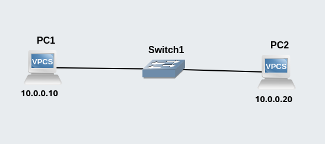

# Basic LAN

---

## Overview

    

The topology showcases three components:

- PC1
- PC2
- Switch

A simple two-box, single-switch LAN.

## Addresses

| PC | Address |
|:--:|:-------:|
| PC1 | 10.0.0.10 |
| PC2 | 10.0.0.20 |
