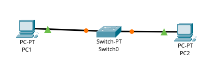

# Overview

    

Basic single-switch two-box LAN;
this Packet Tracer project was made long after I made the previous GNS3 project.
Both are essentially the same topology.

## Objective

- Make sure both computers are connected to the switch
- Configure static IPv4 addresses for the two computers
- Ping PC1 with PC2
- Ping PC2 with PC1

## Addressing

| PC | IPv4 Address |
|----|--------------|
| PC1 | 10.0.0.10   |
| PC2 | 10.0.0.20   |
